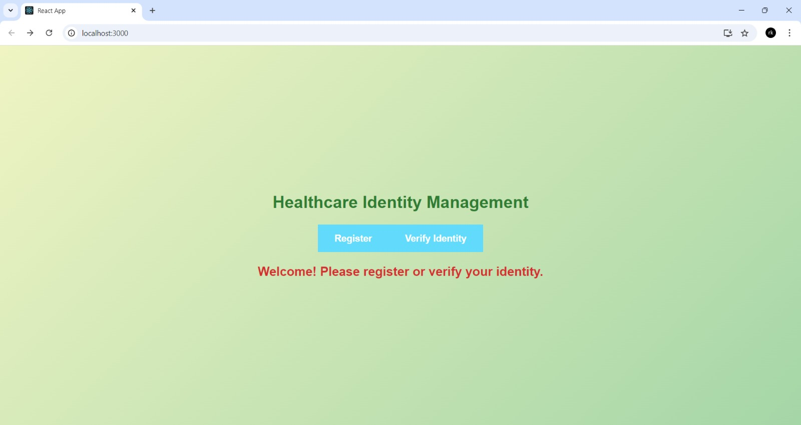
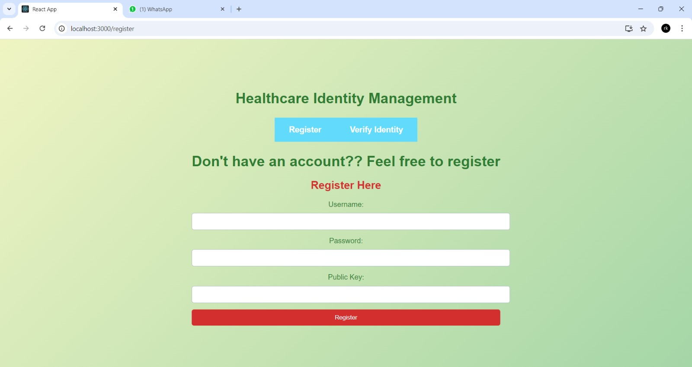
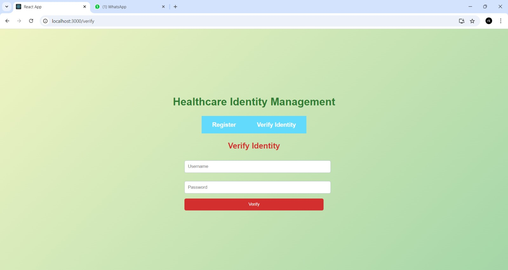
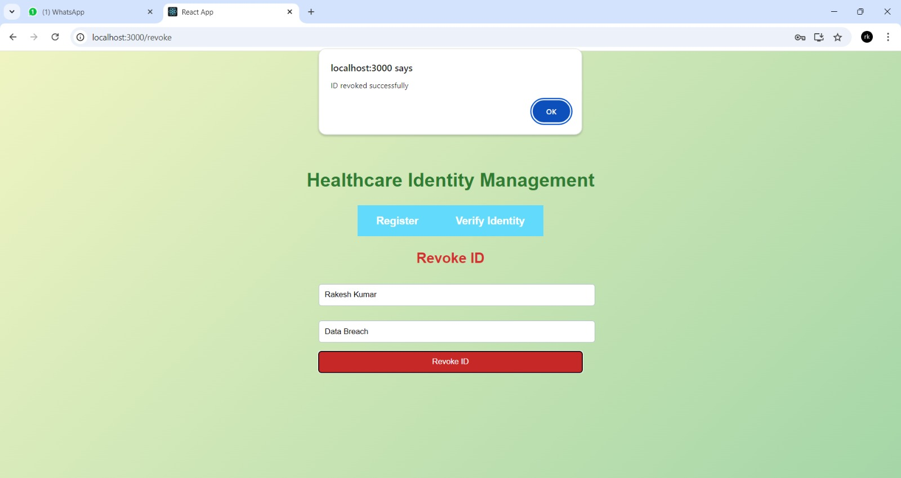

# Health_Care_Id_Revocation

The Healthcare Identity Revocation System is designed to address the need for secure and efficient management of healthcare identities, a critical aspect of safeguarding sensitive patient data and preventing unauthorized access in healthcare settings. The system provides functionalities for user registration, identity verification, and identity revocation, ensuring that only authorized individuals can access or modify healthcare information. Built with security as a primary concern, the system leverages cryptographic techniques like OpenSSL for digital signatures and SHA-256 hashing for password protection, ensuring data security throughout the system.
The project utilizes React.js for the frontend, providing an intuitive user interface, while the backend is developed with Flask to handle server-side logic. MySQL serves as the database to securely store user credentials and revocation records. During user registration, passwords are hashed and stored securely, and identity verification ensures that only authorized users can access protected functionalities. This seamless integration between frontend, backend, and database ensures a smooth user experience while maintaining strict access control.
A critical feature of the system is the ability to revoke healthcare identities when necessary, ensuring that compromised or invalid identities are promptly removed. The system maintains a revocation list, recording the reasons for revocation, thus creating an audit trail for future reference and compliance with healthcare regulations. This enhances the system’s role in maintaining data privacy and security, aligning it with legal standards. The system underwent extensive testing, primarily using Postman for API validation. 
In conclusion, the Healthcare Identity Revocation System offers a secure and effective framework for managing healthcare identities. With robust cryptographic techniques and well-structured data handling, it provides healthcare organizations with a scalable solution to protect sensitive information and ensure compliance with data security standards.

# System Architecture

# How to run application

**Run Back end**

1. Create a virtual environment
2. Install all the necessary packages that is described in requirements.txt
3. Run app.py

**Run Front end**

1. Install the required modules
2. Run "npm start"

# Screenshots

# Team Contributions

**Sureya Narayanan K (21z261) - Front End Development**
 - Implemented Registration.js
 - Integration of all the components of front end

**Aswin Sailesh V S (21z265) - Front End Development**
 - Implemented RevokeID.js
 - Implemented IdentityVerification.js

**Prithivi Raaj K (21z238) - Back End Development**
 - Implemented the backend portion of the project
 - Connection with MySQL and handling the database

**Rakesh Kumar S (21z241) - Back End Development**
 - Implemented the cryptographic algorithms in backend 
 - Documentation of the Project

**Sushanth S (21z262) - Testing and Documentation**
 - Testing the API using Postman
 - Documentation of the Project
